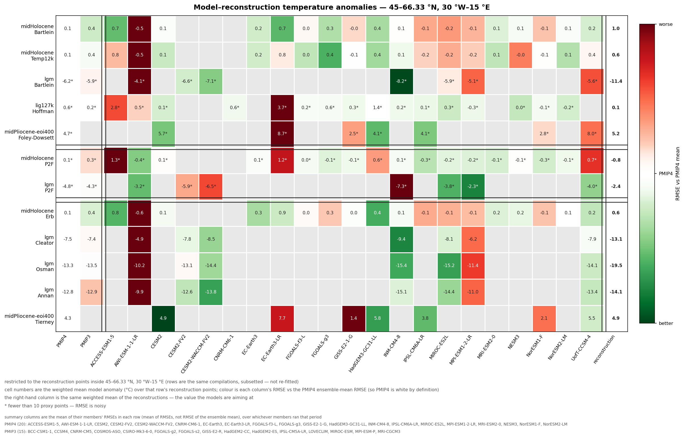
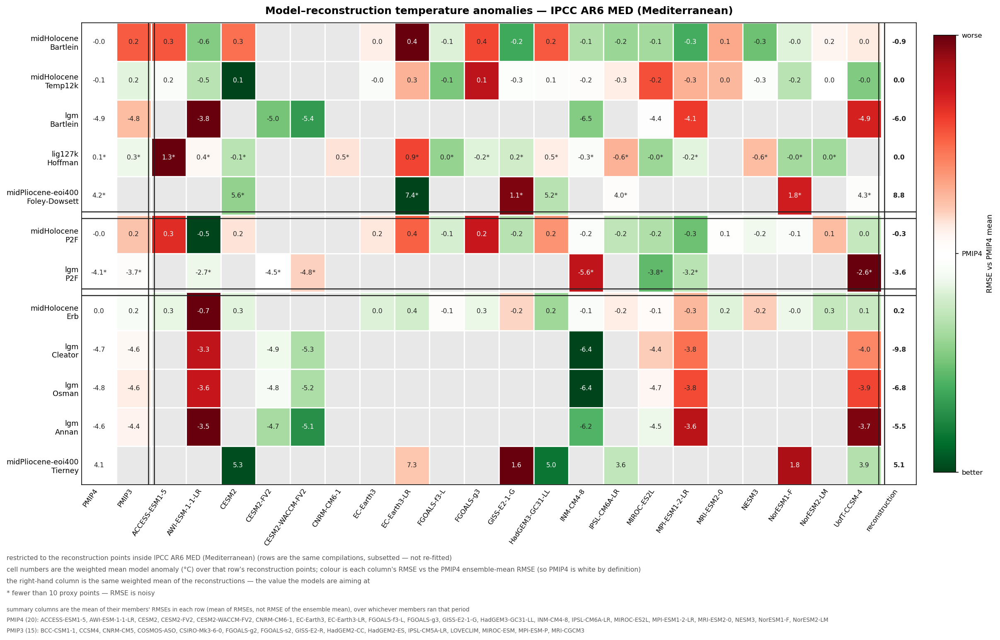

# Outline and code to create a possible paper summarising PMIP4+ and PMIP7 paper

_Rationale:_ This manuscript is intended as a position piece to motivate PMIP7. It will also attempt to summarise the results arising from PMIP4, and categorise which bits of that science happened after AR6.

### Introduction
* Talk about past climate changes as an independent test of model
* Historical background on PMIP
* Explain set-up of PMIP4 and some facts about its inclusion in AR6

### Past climates
* Explain the spread of periods (intro paragraph setting up WGs; then short paragraph on each)
  * mid-Holocene
  * last glacial maximum
  * Last interglacial
  * Pliocene
  * early Eocene
  * past2k

* Include table providing a summary. Base on IPCC AR6 TS table, with # models in each (Chris)

[Figure 1: Comparing regional climate change sginals across experiments, created using the synthesis code.](synthesis_figure/output/synthesis_hexfig.png)

### Insights into past climates
_I'm not so sure what wants to go in this section: ideas?_
* lig127k was new inclusion in CMIP6. Lots of focus on Arctic - learnt that it was seasonally ice-free(?) and only few models can capture this
* Some examples on the regional level?
* Maybe discuss how the model simulations can support insights being drawn from data: [Wharton et al](https://www.nature.com/articles/s41586-024-07655-y) and [Gray et al](https://agupubs.onlinelibrary.wiley.com/doi/full/10.1029/2023PA004666) as examples?

[Figure 2: Scatterplots relating climate indices and modes to global mean temperature change across time periods: after Rehfeld et al 2020, data still needs fixing](scatterplots/output/scatter_vs_gmt.png)

* Discuss role of data assimilation generated 'reconstructions'. Highlight possible circularity. Can I add in Osman and Erb for MH. Osman for LGM and Tierney for Pliocene? 

### Benchmarking

* Provide a (brief) literature review of the benchmarking performed before: separate papers for periods; attempt to combine in IPCC

* Pull together the existing results from the various single-period papers into a single carpet diagram (mainly temp, but also a few hydroclimate). Include a single line for the historical temp trend (from general obs paper: take from CVDP?)

[Figure 3: Benchmarking models' surface air temperature across multi-periods, created using the carpet_diagram code.](carpet_diagram/output/carpet_diagram.png)

* The same benchmarking can be cut to a single region — `carpet_diagram/carpet_regional.py` re-does the statistics over only the reconstruction points inside a lat/lon box, or inside a named IPCC AR6 reference region (`--ar6 MED`). In these regional versions the cell numbers are the weighted mean **model** anomaly and the right-hand column is the same mean of the **reconstruction**, so the two can be read against each other; the colour is still each column's RMSE relative to the PMIP4 mean, as in Figure 3. The first example is NW Europe / the NE Atlantic (45–66.33°N, 30°W–15°E). Treat the starred rows with care: lgm Bartlein, lgm P2F, lig127k Hoffman, midPliocene Foley-Dowsett and midHolocene P2F fall to 3–7 points in that box, and lig127k Capron has none at all so its row drops out.

[Figure 3b: The benchmarking of Figure 3 restricted to reconstructions in 45–66.33°N, 30°W–15°E, created using the carpet_regional code.](carpet_diagram/output/carpet_diagram_euroatlantic.png)

* The second example uses a standard region rather than a box: the IPCC AR6 reference region **MED** (Mediterranean, region 19 of [Iturbide et al. 2020](https://essd.copernicus.org/articles/12/2959/2020/), the set behind the AR6 WGI Atlas), which is the rectangle 10°W–40°E, 30–45°N. Note the models sit much closer to the reconstructions here than over NW Europe — at the LGM they cluster at −4 to −6.5°C against reconstructions of −5.5 (Annan), −6.0 (Bartlein) and −6.8°C (Osman), with Cleator the cold outlier at −9.8°C. The lig127k row rests on a single proxy point and should not be read as evidence.

[Figure 3c: The benchmarking of Figure 3 restricted to reconstructions in the IPCC AR6 Mediterranean (MED) region, created using the carpet_regional code.](carpet_diagram/output/carpet_diagram_med.png)

* Talk about benchmarks and evaluation performed on other fields (e.g. ENSO in midH, salinity/density). Synthesise regional evaluations.

### Insights for future climate _(Gabrial Pontes)_

* A brief paragraph talking about the benefit of past for future insights.
* Paragraph summarising multi-model studies that include the future: drawing connections within model world
* Paragraph looking at paleo-constraints. Discuss Lunt et al (2024) constraining ECS directly using PMIP outputs. Jiang Zhu's palaeo-calibrated CESM2 and Peter Hopcroft's work
* Paragraph pushing into work explaining the physical mechanisms: e.g. Yoshimori et al; He at al
* Any quantitative examples (maybe Osman et al 2026) 

[Figure 4: Schematic showing examples of how to leverage insight from paleoclimate models into future projections](past2future-examples.png)

### Outlook for PMIP7

[Figure 5: The PMIP7 experiments and their relationship to CMIP7.](expts-plan/expts-plan.temp-vs-resources.png)

* Brief description of CMIP7, and slightly shifted nature of PMIP within it
* Describe abrupt127k experiment and focus on Arctic
* Explain expansion into Miocene
* Data assimilation and shift in focus of past2k simulation
* Proxy modelling as a benchmarking approach (with mid-Holocene)?
* Suggest something about near-term timings
* Wider vision and summary
